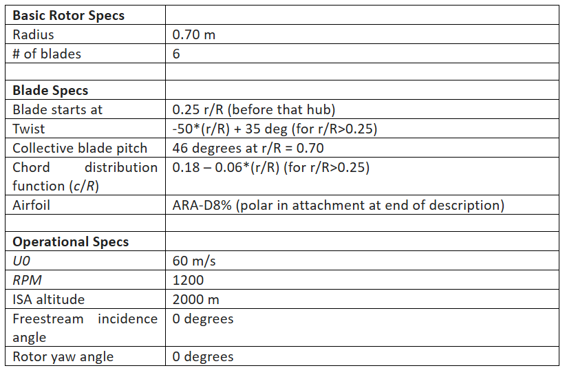

# Baseline Specs

# Tasks:

For this assignment you need to submit a short report, containing:
1. SHORT introduction (1 page)               [5’]
2. A flowchart of your code (1 page)       [5’]
3. Main assumptions with an explanation of their impact (max. 1 page)            [5’]
4. Plots with explanation of results (alpha/inflow/a/a’/Ct/Cn/Cq vs r/R)
    - Spanwise distribution of angle of attack and inflow angle [8’]
    - Spanwise distribution of axial and azimuthal inductions    [8’]
    - Spanwise distribution of thrust and azimuthal loading       [8’]
    - Total thrust and torque versus tip-speed ratio/advance ratio  [8’]
5. Plots with explanation of the influence of the tip correction                            [8’]
6. Plots with explanation of influence of number of annuli, spacing method (constant, cosine) and convergence history for total thrust.                             [9’]
7. Explanation of the design approach used for maximizing the Cp or efficiency  [5’]
8. Plots with explanation of the new designs                                                          [8’]
9. Plot the distribution of stagnation pressure as a function of radius at four locations: infinity upwind, at the rotor (upwind side), at the rotor (downwind side), infinity downwind.                                                                                      [10’]
10. Discuss the operational point of the airfoil in terms of lift and drag, and the relation between the distribution of lift coefficient and chord (choose one case, not necessary to do all cases)                                                                             [8’]
11. SHORT discussion/conclusion, highlighting the impact of operational variables and BEM model assumptions on the results.     